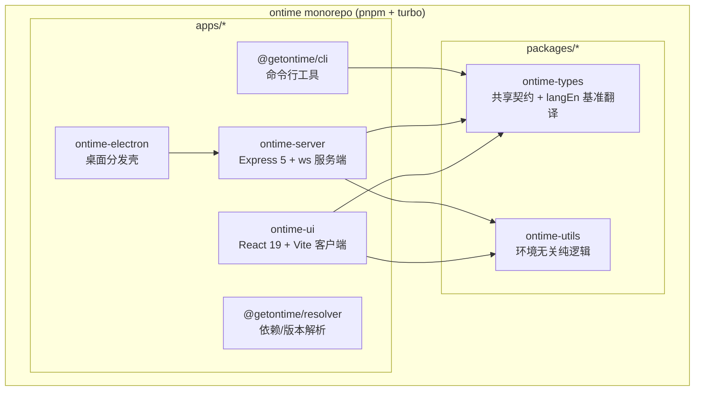
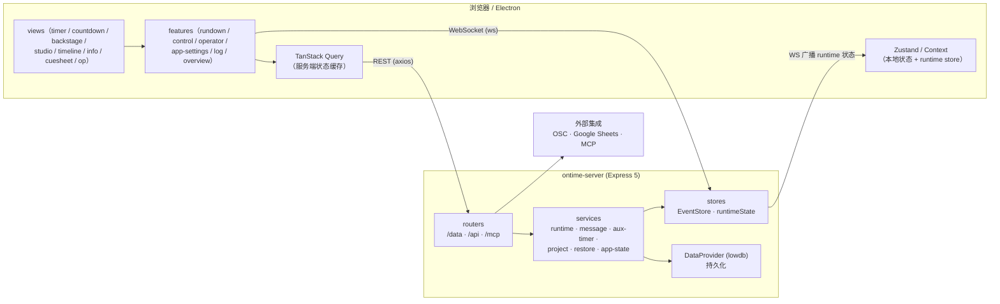
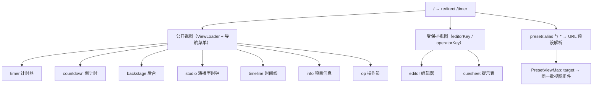
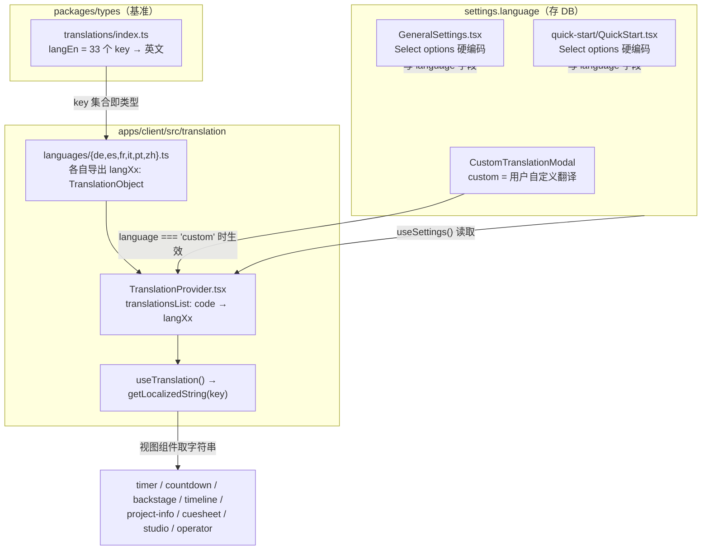
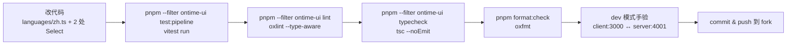

# ontime 项目全景（mermaid）

> 基于 v4.13.1 源码整理。所有结论以源码为准，标注了文件位置便于回查。

## 1. 仓库 / 工作区全景

pnpm monorepo，5 个 app + 2 个共享 package：

依赖方向：app → shared packages，**shared packages 永不反向依赖 app**（见 `docs/agent-guides/architecture.md`）。

## 2. 运行时架构全景

关键点：

- **双通道**：REST（`apps/client/src/common/api`）管持久化数据；WebSocket（`apps/client/src/common/utils/socket` + `common/hooks/useSocket`）管运行时状态（播放、消息、auxtimer）。
- **服务端分层**：router → controller → service → store/DAO（`docs/agent-guides/architecture.md` 的依赖方向）。
- **适配器**：`apps/server/src/adapters/` 下 OscAdapter、WebsocketAdapter。

## 3. 视图路由全景

- 路由表：`apps/client/src/AppRouter.tsx`（全部 `lazy` 加载）。
- **语言只影响「公开视图」**——设置页原文：*Changes to the views language does not affect the editor view*（`GeneralSettings.tsx:97`）。

## 4. i18n 机制全景（本次改动核心）

数据流细节（`TranslationProvider.tsx:40-52`）：

1. `getLocalizedString(key, lang = settings.language ?? 'en')`；
2. `lang` 在 `translationsList` 中 → 返回对应语言值，**缺 key 时回落英文**（`langEn[key]`）；
3. `lang === 'custom'` → 返回用户自定义翻译；
4. 其余（含 `zh` 未注册时）→ 回落英文。

翻译 key 共 33 个，分四组：`common.*`（16）、`countdown.*`（9）、`timeline.*`（6）、`project.*`（4）。

## 5. 开发 / 验证流程全景

- 验证顺序来自 `docs/agent-guides/workflow.md`：focused test → package lint/typecheck → 仓库级检查。
- 新增功能必须实测后才能交付（用户工程规则 ③）。
